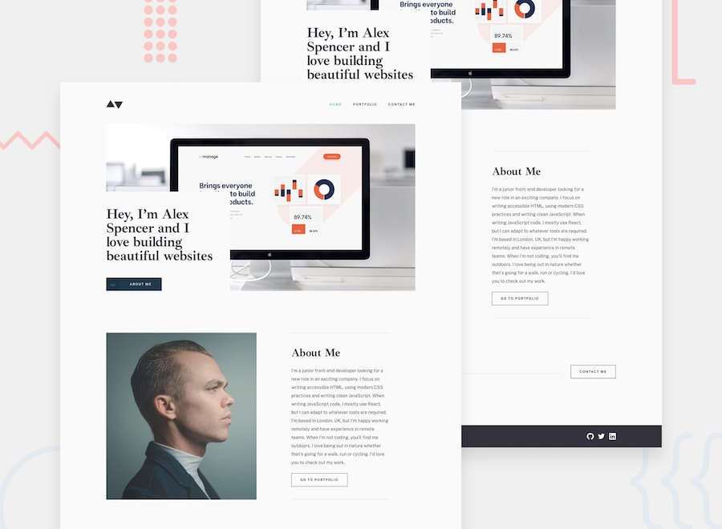

# Frontend Mentor - Minimalist portfolio website solution

This is a solution to the [Minimalist portfolio website challenge on Frontend Mentor](https://www.frontendmentor.io/challenges/minimalist-portfolio-website-LMy-ZRyiE). Frontend Mentor challenges help you improve your coding skills by building realistic projects. 

## Table of contents

- [Overview](#overview)
  - [The challenge](#the-challenge)
  - [Screenshot](#screenshot)
  - [Links](#links)
- [My process](#my-process)
  - [Built with](#built-with)
  - [What I learned](#what-i-learned)
  - [Continued development](#continued-development)
- [Author](#author)
## Overview

### The challenge

Users should be able to:

- View the optimal layout for each page depending on their device's screen size
- See hover states for all interactive elements throughout the site
- Click the "About Me" call-to-action on the homepage and have the screen scroll down to the next section
- Receive an error message when the contact form is submitted if:
  - The `Name`, `Email Address` or `Message` fields are empty should show "This field is required"
  - The `Email Address` is not formatted correctly should show "Please use a valid email address"

### Screenshot



### Links

- Solution URL: [Github Repo](https://github.com/jmcbutter/minimalist-portfolio-site/tree/solution)
- Live Site URL: [Github Pages](https://jmcbutter.github.io/minimalist-portfolio-site/#/portfolio)

## My process

### Built with

- Semantic HTML5 markup
- Mobile-first workflow
- [React](https://reactjs.org/) - JS library
- [Chakra UI](https://chakra-ui.com/) - React component library

### What I learned

This project was the first project I built using React. While building it, I was able to get experience with using hooks to manage state, experience with using router to handle links, and plenty of experience using props and destructuring thanks to Chakra UI (styling was performed by passing styles to Chakra components via props).

One unique challenge I ran into was dealing with so many images to handle art direction and resolution switching. I was able to eventually handle this by tweaking the Chakra image component to switch sources at breakpoints using Chakra's ```useBreakpointValue()``` hook.

### Continued development

I will continue focusing on building projects using React, and will also focus on creating clean React code. I am also personalizing this project to use as my own portfolio page for the time being, as it provides a clean layout with an emphasis on projects.

## Author

- Website - [Jordan Butterfield](https://jmbutterfield.com)
- Github - [@jmcbutter](https://github.com/jmcbutter)
- Frontend Mentor - [@jmcbutter](https://www.frontendmentor.io/profile/jmcbutter)
- LinkedIn - [Jordan Butterfield](https://www.linkedin.com/in/jordan-butterfield-933274a9/)

